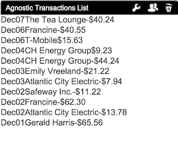

# widget-agnostic-transactions-list
This repository will show how to create a transactions list widget without any dependency but CXP 5.6 platform.

## Index
* Start with an empty repository.
* Explain how to import the widget in CXP. 
* Create the minimum structure to import your widget to the editor.
* Modify the markup to show a 'Hello World' message.
* **Modify the markup to show a list of items.**
	* Each item will contain:
		* Date:
			* Month name, only three characters. i.e. 'Dec' -> 'December'
			* Day of the month, two characters. i.e '09', '10'
		* Description:
			* The description of the transaction.
		* Amount:
			* Two decimals. i.e. 40 -> 40.00
			* Currency sign. i.e. 40 -> $40.00
			* Payment transactions. i.e. 40 -> -$40.00
* Fill the list from Javascript using fake data.
* Fill the list from Javascript using XHR to fetch the data from a file with fake data.
* Improve the markup to be easily styled from the theme.
	* **Styles in widget should only be used for scaffolding**
* Create a new theme for our portal.
* Style our list to look as the Transactions List Screenshot.

  

### Section
#### Modify the markup to show a list of items
Open your *index.html* file and add a class in your BODY node that will be unique and specific for your widget.
  This is very important to namespace your widget styles.
Add the markup to create a list following the structure it's supposed to be.

Import the widget again, reload your page and you will see something like...
 
 

Doesn't looks very nice but we will improve later.