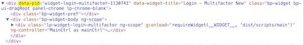

# widget-agnostic-transactions-list
This repository will show how to create a transactions list widget without any dependency but CXP 5.6 platform.

## Index
* Start with an empty repository.
* Explain how to import the widget in CXP. 
* **Create the minimum structure to import your widget to the editor.**
* Modify the markup to show a 'Hello World' message.
* Modify the markup to show a list of items.
	* Each item will contain:
		* Date:
			* Month name, only three characters. i.e. 'Dec' -> 'December'
			* Day of the month, two characters. i.e '09', '10'
		* Description:
			* The description of the transaction.
		* Amount:
			* Two decimals. i.e. 40 -> 40.00
			* Currency sign. i.e. 40 -> $40.00
			* Payment transactions. i.e. 40 -> -$40.00
* Fill the list from Javascript using fake data.
* Fill the list from Javascript using XHR to fetch the data from a file with fake data.
* Improve the markup to be easily styled from the theme.
	* **Styles in widget should only be used for scaffolding**
* Create a new theme for our portal.
* Style our list to look as the Transactions List Screenshot.

  

### Section
####Create the minimum structure to import your widget to the editor
In order to import our widget to CXP it's needed a minimum structure.

The minimum files required are:
* index.html
* model.xml

**index.html**

It will be the file that will be read by CXP to add it in your portal.

CXP server reads this HTML file and:

* Transforms your BODY node following to add it in your portal page.
* It adds the LINK nodes to the end of the HEAD node in your portal page.
* It adds the SCRIPT nodes to the end of the BODY node in your portal page.

  
  
**[model.xml](https://my.backbase.com/resources/documentation/portal/5.5.0/devd_depl_impe_ware_mode.html)**

It's the file that tells CXP about the widget.

* **src:** 
	* Where the *index.html* or source file can be found.
* **thumbnailUrl:** 
	* Where the *icon.png* can be found. 
		* This is used to show it in the "Enterprise Catalog" and in "Portal Catalog" to easily identified your widget among others.
* **title:** 
	* What's the *title* of our widget.
 	* This is used to be shown in the "Enterprise Catalog" and in "Portal Catalog" to be easily found using the search input.
* **contextItemName:**
	* What's the *context* of our widget.
		* Usually this is set to **[BBHOST]** and when the widget it's imported it will be added in the "Enterprise Catalog" available for all the portals.
 		* This property can be used to narrow the usage of the widget to an specific portal only. 
 			* Replace **[BBHOST]** by the name of your portal and it will be added automatically to your portal.
 			
* **order:**
	* What's the *order* of our widget in it's container.
		* It's set to 0 by default.
* **area:**
	* What's the *area* in the page where the widget is added.
		* It's set to 0 by default.
* **widgetChrome:**
	* This is a property that can be used to add a wrapper to our widget, even doing possible to do it draggable if needed.
		* It's set to "chrome-blank.html* by default that doesn't add any special behaviour.


Once we have created the minimum files required to import it in CXP we will execute the "import-item" command using **bb-cli** tool.

```
bb import-item
```
