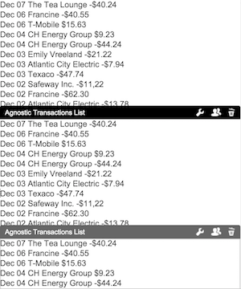

# widget-agnostic-transactions-list
This repository will show how to create a transactions list widget without any dependency but CXP 5.6 platform.

## Index
* Start with an empty repository.
* Explain how to import the widget in CXP. 
* Create the minimum structure to import your widget to the editor.
* Modify the markup to show a 'Hello World' message.
* Modify the markup to show a list of items.
	* Each item will contain:
		* Date:
			* Month name, only three characters. i.e. 'Dec' -> 'December'
			* Day of the month, two characters. i.e '09', '10'
		* Description:
			* The description of the transaction.
		* Amount:
			* Two decimals. i.e. 40 -> 40.00
			* Currency sign. i.e. 40 -> $40.00
			* Payment transactions. i.e. 40 -> -$40.00
* Fill the list from Javascript using fake data.
* **Fill the list from Javascript using XHR to fetch the data from a file with fake data.**
* Improve the markup to be easily styled from the theme.
	* **Styles in widget should only be used for scaffolding**
* Create a new theme for our portal.
* Style our list to look as the Transactions List Screenshot.

  

### Section
#### Fill the list from Javascript using XHR to fetch the data from a file with fake data.
The idea of this step is to recreate the same list but using XHR to fetch the data from a hardcoded endpoint.

**Steps:**
* Open the Javascript main file.
* Create a "request" function that will use XHR object to fetch the data from a file.
* Create a data folder where the fake data will be stored.
* Create a JSON file with the fake data we used in the previous section.
	* I named it "transactions.json"
* Add the code to you Javascript main file to fetch the data using your request function.
	* Mind that it will return you a plain text so you will need to parse it to convert it in a Javascript object.
* Render the list using that data.
* Import your widget again.
* Reload your page.

It will look like the next screenshot:

  
  
You also can add more than one widget in the same page.
  
  