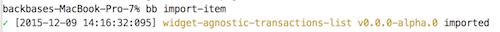
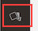
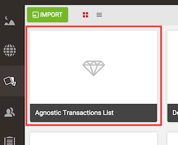
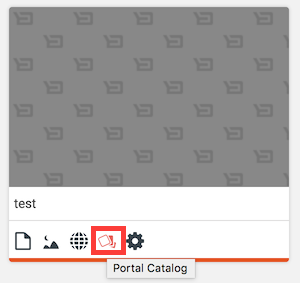
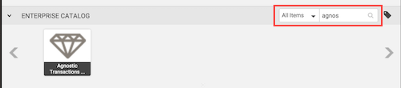
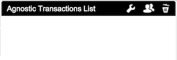
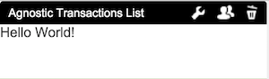

# widget-agnostic-transactions-list
This repository will show how to create a transactions list widget without any dependency but CXP 5.6 platform.

## Index
* Start with an empty repository.
* Explain how to import the widget in CXP. 
* Create the minimum structure to import your widget to the editor.
* **Modify the markup to show a 'Hello World' message.**
* Modify the markup to show a list of items.
	* Each item will contain:
		* Date:
			* Month name, only three characters. i.e. 'Dec' -> 'December'
			* Day of the month, two characters. i.e '09', '10'
		* Description:
			* The description of the transaction.
		* Amount:
			* Two decimals. i.e. 40 -> 40.00
			* Currency sign. i.e. 40 -> $40.00
			* Payment transactions. i.e. 40 -> -$40.00
* Fill the list from Javascript using fake data.
* Fill the list from Javascript using XHR to fetch the data from a file with fake data.
* Improve the markup to be easily styled from the theme.
	* **Styles in widget should only be used for scaffolding**
* Create a new theme for our portal.
* Style our list to look as the Transactions List Screenshot.

  

### Check that the widget has been added to your portal
In the last step we executed the command to import the widget, in our terminal, if it was ok you should see something like the next screenshot.

  

**If you see something diferent you should check the next list to solve the issues:**

* Check that your CXP server is running.
* Check that the url of your CXP server is "http://localhost:7777/portalserver"
* If the url is different you have to create a **[.bbrc](https://github.com/Backbase/bb-cli)** file with the correct configuration.

	{
		"context": "/",
		"port": "7778",
		"username": "me",
		"password": "it's me"
	}

* Check the paths you indicated in your model.xml.
* Check that your index.html is an HTML valid file.
* Follow the indications in the message.

**To check that our widget has been added to CXP we should:**

* Open [CXP-Manager](http://localhost:7777/portalserver/cxp-manager)
* Click in the link to open "Enterprise Catalog"

  

* CXP orders the features and widgets by the time they have been imported so you should see your widget the first title on the page.
  
  
  
Widgets imported in "Enterprise Catalog" are not added automatically to your portal so that you can decide what widgets will be used in which portal, but it also means 
that you have to enable it in your portal.

**To enable the widget in your portal:**

* Open [CXP-Manager](http://localhost:7777/portalserver/cxp-manager)
* Move the mouse over your portal's thumbnail and click in the portal-catalog link 

  

* In Portal Catalog filter your widget by name to find it easily.

  

* Do mouse over in your widget and it will show a plus sign, click on it and the widget will be added to your portal.

Now that you have added your widget to your portal it's time to create a new page and drag it on it.

You will see it added in the page but nothing inside because we have not added anything yet in our html.

  

### Section
#### Modify the markup to show a 'Hello World' message.
Open your *index.html* file and insert "Hello World" inside of the BODY node, save it and execute the import once time more.
Reload your page and you will see the message where you widget was been added.

  
  
